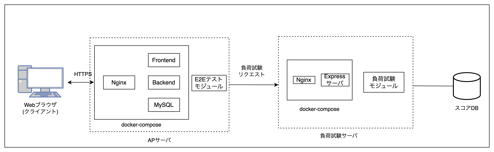
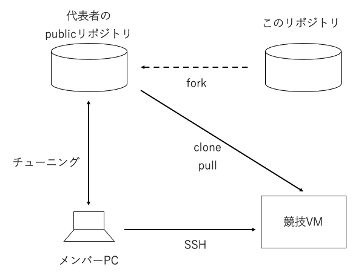

# 競技の概要と環境

## 競技概要

規定時間までに、課題アプリケーションである「Talent Fuse」のバックエンドをチューニングし、パフォーマンスを改善してください。

各チームは専用の採点モジュールを使ってパフォーマンスを採点できます。課題提出の締め切りまでに運営に送信されたスコアが最も高いチームが優勝です。
採点は何度も実施可能で、レギュレーションに違反していない一番高いスコアが最終結果として利用されます。

レギュレーションは[別文書](../rules/02_Regulation.md)にまとめています。

## 競技環境構成

 

**DBサーバ**と**APサーバ**が同居の 1VM 構成ですが、**負荷試験サーバ**は別のサーバになります。したがって、VM環境で負荷試験を行う場合は負荷試験サーバに負荷試験のリクエストを送ります。

サービスは docker compose 上の複数のコンテナによって構成されてます。各コンテナの役割は以下の通りです。

- nginx: SSL 終端、及びリクエストの frontend または backend への振り分け
- mysql: ファイル以外のユーザ情報を保管
- frontend: Next.js + Typescript で実装、ビルドされた html/javascript コードを提供
- backend: クライアント向けの API を提供 (一部フロントエンド用の API を含む)。Rust で実装

Web ブラウザは frontend からのコードを実行し、クライアントとして動作します。

クライアントは backend から提供された API を利用することで、ユーザに機能を提供します。

サービス利用が開始されているため、ユーザー・部署・役職などのデータや添付ファイル等はすでに登録されているものとします。

\*本競技では、クライアント側は改善対象ではありません。

### インフラ情報

競技環境は Azure で構築しています。

- VM: Standard D2as v4 (2 vcpu 数、8 GiB メモリ)
- ディスク: StandardHDD S4

## 競技の進め方

    

 

このリポジトリを、チームの代表者 1 名の GitHub アカウントの Public リポジトリに fork してください。チューニングの成果物は fork したリポジトリの main ブランチにコミットしてください。

チーム毎に 1 つずつ環境を用意しています。配布される環境 ID、および秘密鍵で VM に SSH ログインできます。

チューニングした結果を fork リポジトリから pull して VM 内で実行、採点できます。

競技の始め方については、下記ドキュメントをご覧ください。  
[最初にやること](../setup/01_Start.md)

採点については、別途詳細をドキュメント化しています。  
[採点について](../rules/03_Scoring.md)

---

[トップ](../../README.md)
