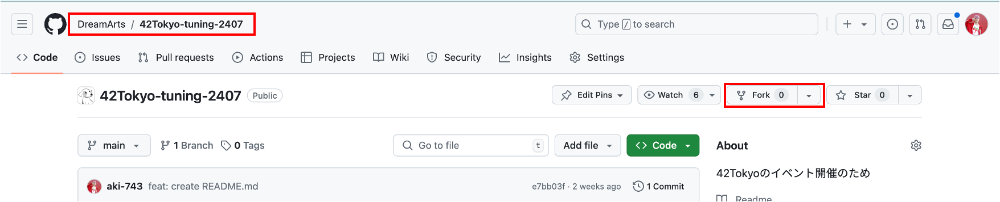

# 最初にやること

## 環境構築

VM 環境での競技開始手順の説明をします。

### 必要なもの

- 秘密鍵: {チームID}.pem という形式のファイル (各チームに配布予定です。)
- VM のドメイン: {チームID}.ftt2407.dabaas.net (上記秘密鍵の名前から特定できます。)

### 手順(ローカル)

1. このリポジトリを、チームの代表者 1 名の GitHub アカウントの Public リポジトリに fork してください。チューニングの成果物は fork したリポジトリの main ブランチにコミットしてください。
    <div align="center">
        
    </div>

1. 配布された秘密鍵を 各自の PC の任意の場所に置き、アクセス権限を適切に設定してください。

    ```bash
    $ chmod 400 {秘密鍵のパス}
    ```

1. 秘密鍵に対応した VM のドメインを利用して、環境にログインしてください。

    ```bash
    $ ssh -i {秘密鍵のパス} azureuser@{VMのドメイン}
    ```

### 手順(VM)

1. ホームディレクトリにある entry.sh を実行し、fork したリポジトリの URL を入力してください。docker コンテナが起動し、初期データが投入されます。

    **※初回起動時は docker build のキャッシュがないため、コンテナの起動に時間がかかる可能性があります。**

    ```bash
    $ bash entry.sh
    forkしたリポジトリのURLを入力ください: https://github.com/{your-name}/42Tokyo-tuning-2407.git

    ===================================================
    
    
    初期化に成功しました。以下を確認してみてください
    ・web画面へアクセスできること(https://{チームID}.ftt2407.dabaas.net/)
    ・初期スコアの計算（ルートディレクトリのrun.shを実行してみてください。）
    
    
    ===================================================
    ```

    「初期化に成功しました。」という出力がされていれば、無事に VM 環境での開発準備ができています。[https://{チームID}.ftt2407.dabaas.net/]() にアクセスしログイン画面が表示されるか確認してみてください。反映に少し時間がかかる場合もあるので、キャッシュを削除したり少し時間置いたりしてください。

1. リポジトリ内に移動し、評価スクリプトを動かしてみてください。

    ```bash
    $ cd 42Tokyo-tuning-2407
    $ bash run.sh
    負荷試験を開始するためのリクエストを送信します。

    ===================================================


    負荷試験のリクエストに成功しました。
    ジョブID: aaa-bbb-ccc-ddd
    上記のジョブIDをもとに負荷試験のステータスを確認できます
    bash ./get_test_status.sh {ジョブID} {IPアドレス}


    ===================================================
    ```

1. 表示されたコマンドをそのままコピペし負荷試験結果をリスニング

    ```bash
    bash ./get_test_status.sh {ジョブID} {IPアドレス}
    ```

    ※今回のチューニングコンテストでは、APサーバと負荷試験サーバを分けています。

## 最初の採点終了後

- ここまでの手順が無事に終わると、運営にスコアが送信されます。
- この後は自由にチューニングを進めてもらって大丈夫です。
- 競技概要ついては下記のドキュメントをご参照ください。
  <!-- - [競技概要](../env) -->
  - [競技概要](../rules/01_Contest.md)
- 作業効率化のために、ローカル環境での開発環境の構築を行うことをお勧めします。

---

[ローカル環境での開発](./02_Local.md)

[トップ](../../README.md)
