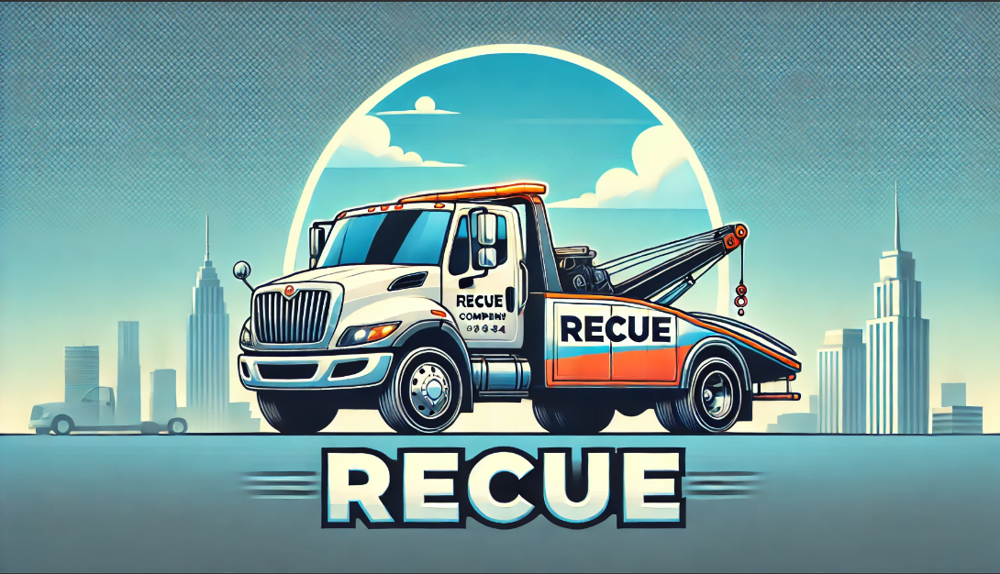
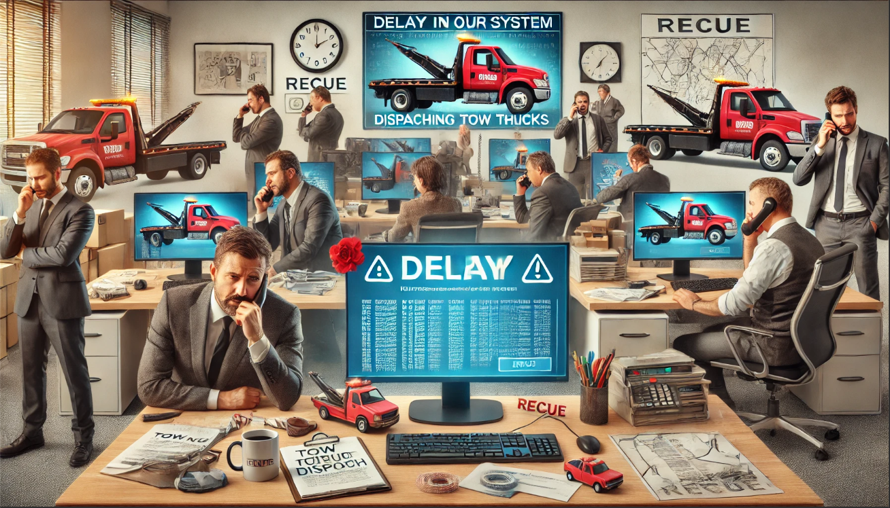

# はじめに

*この物語はフィクションです。

## 導入

株式会社 RECUE は、全国に 10 の拠点を持ち、グループ連結従業員が 1 万人にのぼる大規模なレッカー車配車サービス会社である。RECUE では、顧客からの配車要請を迅速に処理するために、自社システムを用いてレッカー車の管理を行っていた。しかし、近年のサービス拡大に伴い、システムのパフォーマンスに関する問題が発生し、配車の遅延やシステムの停止が頻繁に起こるようになった。

 

この問題に対し、SaaS 企業であるドリーム・アグリゲーションが、自社で開発している配車管理システム「TowTruck Manager Pro」の導入を提案。「TowTruck Manager Pro」は、社内のレッカー車情報を一元管理できるシステムであり、最適な配車を実現するための高度なアルゴリズムを備えている。また、目玉機能として、レッカー車の稼働状況やメンテナンス情報をリアルタイムで把握できるダッシュボードを提供する。

    

 

SaaS サービスであるためインフラ管理を考える必要がなく、また目玉機能である「リアルタイムダッシュボード」が評価され、無事 RECUE での採用が決まった。

しかし、導入から 3 年が経ち、サービスのパフォーマンスに関するサポートへの問い合わせが急増した。サービス利用者の拡大に伴い、パフォーマンス問題が頻発。既に先方の業務で深く使ってもらっていることもあり、業務への影響も大きく、営業やサポートは謝罪の毎日。

    

 

この状況に対し、サービス提供を一時中断しその間にパフォーマンス改善を実施する方向で先方と合意。ドリーム・アグリゲーション社内の精鋭を集め、専用の「パフォーマンス改善チーム」を結成することになった。

    

 

営業メンバー及び CTO の尽力により、なんとかサービスの緊急メンテナンス期間を確保できたが、その期間は 2 日間。この間にパフォーマンスを改善し、サービスの立て直しをすることが、チームのミッションである。

---

[最初にやること（VM の環境構築）](./md/setup/01_Start.md)

[トップ](../../README.md)
